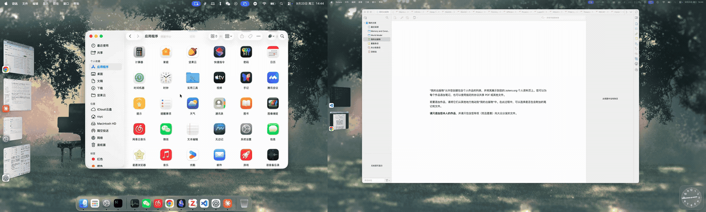

# StageSolo

[English](README.md)

多块屏开着台前调度时，点某块屏左侧小条里的缩略图，**只切换这一块屏**。

macOS 会把一个 app 在各块屏上的窗口一起调到前面。比如 Chrome 在笔记本屏和外接屏上各开了一个窗口，你在笔记本屏的小条里点 Chrome，外接屏可能也会跟着换成 Chrome。装上 StageSolo 后，点哪块屏就只切哪块屏，对所有 app 都有效。

**没有 StageSolo 时**，在笔记本屏（左）的小条里点 Chrome，外接屏（右）也会跟着变成 Chrome：


**有 StageSolo 时**，只有笔记本屏切换：



StageSolo 是一个菜单栏小工具：只有一个 Swift 文件，没有任何依赖，完全用 Claude Code vibe coding 写成。

## 要求

- macOS 13 或更新版本，开启台前调度，接了两块或更多屏幕
- 辅助功能权限（见[隐私](#隐私)）

目前只在 macOS 26.6、Apple 芯片、三块屏的环境下测过，欢迎反馈其他环境下的情况。

## 安装

需要先装 Xcode 命令行工具（`xcode-select --install`）。

```bash
git clone https://github.com/ubinaroy/StageSolo.git
cd StageSolo
make install
```

这会编译出 `StageSolo.app`，复制到 `~/Applications` 并启动。系统询问时，在 **系统设置 → 隐私与安全性 → 辅助功能** 里允许 StageSolo。菜单栏图标变成实心，就表示已经生效。

## 使用

照常点缩略图即可。和台前调度一样，StageSolo 在你按下的那一刻就生效。菜单栏图标里有：

- **暂停 / 继续**
- **登录时启动**
- **关于**、**退出**

想把一个窗口加进当前这一组，就按住 ⇧ 点它的缩略图（这是台前调度自带的快捷方式）。按着 ⇧、⌥、⌘ 或 ⌃ 的点击，StageSolo 一律交给台前调度处理。

## 原理

1. 用鼠标事件监听（event tap）查看落在每块屏左右边缘附近的按下。
2. 台前调度把小条里的缩略图画成缩小了的真实窗口，窗口列表里报告的就是缩略图大小。StageSolo 据此找出鼠标下面是哪个窗口。按在缩略图下方的 app 小图标上，就算作按在和这个图标重叠最多的那张缩略图上。编在同一组里的窗口，在小条里是几张叠在一起的缩略图，StageSolo 把它们当作一个整体。
3. 如果这个 app，或者和它编在一组的 app，在别的屏上也有窗口，StageSolo 就接管这次按下，只把一个窗口调到前面，也就是这一组最前面的那个：用 `_SLPSSetFrontProcessWithOptions` 只激活这个窗口，再发送合成的"设为焦点窗口"事件，最后通过辅助功能接口把它提到最前（yabai 用的就是这套办法）。这样台前调度只会切换这个窗口所在的屏，组里其他窗口会一起回来。
4. 其余按下一律放行，包括所有 app 都只在一块屏上的分组。

## 限制

- 只处理小条里缩略图上的按下。⌘Tab、Dock、点链接跳转，仍然会让所有屏一起切。
- 用到了 macOS 的非公开接口，系统更新后可能失效。
- 台前调度很难把"在别的屏上也有窗口"的 app 加进分组：按住 ⇧ 点它，会直接切过去而不是编组（在 macOS 26.6 上看到的，装不装 StageSolo 都一样）。所以包含这类 app 的分组基本没测过。
- 台前调度本身不支持把小条里的缩略图拖进分组，装不装 StageSolo 都一样（在 macOS 26 上，一按下缩略图就会切换）。想把窗口加进当前分组，请用 ⇧ 点击。最小化窗口不会让它离开分组，要把它从中间拖回小条。

## 隐私

StageSolo 只看鼠标左键点击，不碰键盘；不联网，也不收集任何数据。每次处理过的点击会写进 macOS 统一日志，内容是 app 名、窗口编号和调用结果。

## 排查问题

```bash
log show --last 10m --predicate 'subsystem == "io.github.ubinaroy.StageSolo"'
```

看到 `Google Chrome window 72 on display 1: front=0 raise=0` 这样的行，就表示有一次点击被处理了，两步调用都成功。想看 StageSolo 检查过的每一次按下、以及为什么放行，用同样的条件运行 `log stream --level info`。

## 重新编译

`make install` 会重新编译并安装。默认是 ad-hoc 签名，macOS 会把每个新版本当成新 app，需要在辅助功能列表里删掉 StageSolo 再重新允许。想省掉这一步，可以在"钥匙串访问"里建一次代码签名证书（**证书助理 → 创建证书…**，名称填 `StageSolo Dev`，身份类型选"自签名根证书"，证书类型选"代码签名"）。Makefile 发现这个证书就会用它签名，之后重新编译，系统会一直记得这个权限。

## 卸载

关掉 **登录时启动**，退出 StageSolo，删除 `~/Applications/StageSolo.app`，再到辅助功能列表里删掉 StageSolo。

## 致谢

"只调出一个窗口"的办法来自 [yabai](https://github.com/koekeishiya/yabai)，[AltTab](https://github.com/lwouis/alt-tab-macos) 也用同样的办法。

## 许可证

[MIT](LICENSE)
